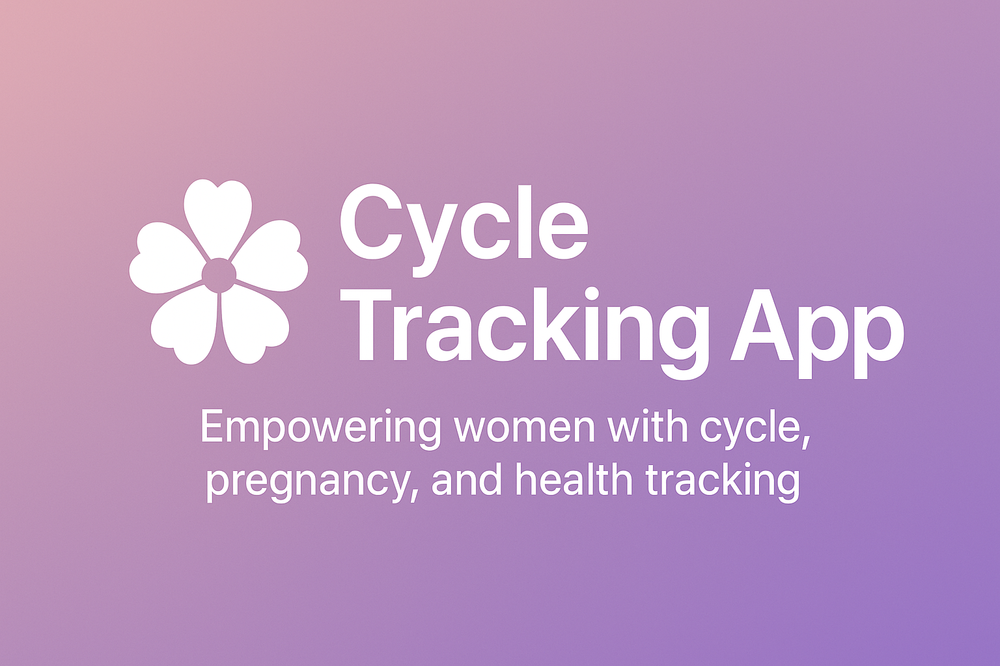

  

# Cycle Tracking App - Frontend

A modern web application designed to empower women with **cycle tracking, pregnancy monitoring, health insights, and community support**. Built with **Next.js** and **Tailwind CSS**, the app combines medical accuracy, personalization, and a friendly user interface to create a trusted space for women’s health management.  

⚠️ **Note**: This project is **not open source**. The code is proprietary and cannot be cloned, redistributed, or modified. This repository exists to **showcase the project** and share insights with the community.  

---

## 🌸 Project Overview

The **Cycle Tracking App** helps users manage their reproductive health journey. From logging menstrual cycles and predicting ovulation to monitoring pregnancy and engaging in a supportive community, it offers a **comprehensive health companion**.  

It is designed for:  
- **Users**: Track cycles, symptoms, and pregnancy data.  
- **Doctors**: Access health insights for patient guidance.  
- **Admins**: Manage users, community posts, and app settings.  

---

## ✨ Key Features

### 🌙 Cycle & Health Tracking
- Log periods, moods, and symptoms.  
- Predict ovulation and fertile windows.  
- Track postpartum and irregular cycles.  

### 🤰 Pregnancy Support
- Schedule pregnancy checkups.  
- Access pregnancy dashboards.  
- Monitor health trends during pregnancy.  

### 🧘 Wellness & Insights
- Personalized health recommendations.  
- Nutrition tracking and reminders.  
- Visualize health metrics (weight, BP, moods).  

### 💬 Community Engagement
- Post, comment, and react in a moderated forum.  
- Connect with others for support and shared experiences.  

### 🎨 User Experience
- **Responsive UI**: Optimized for mobile & desktop.  
- **Light/Dark Themes**: Switch seamlessly.  
- **Data Visualizations**: Beautiful charts powered by `recharts`.  
- **Calendar View**: Simple cycle overview using `react-calendar`.  

---

## 🖼️ Screenshots (Preview)

> _(Add screenshots here to visually showcase your app — home page, cycle tracking form, pregnancy dashboard, etc.)_  

- **Cycle Logging Form** 📝 
- **Health Insights Dashboard** 📊  
- **Pregnancy Checkup Tracker** 🩺  
- **Community Feed** 💬  

---

## 🛠️ Tech Stack

- **Frontend Framework**: Next.js (App Router)  
- **Styling**: Tailwind CSS with custom themes  
- **State Management**: React Context API  
- **Authentication**: JWT-based with role-based access  
- **Data Visualization**: Recharts, React Calendar  
- **Fonts**: Outfit, Plus Jakarta Sans, Poppins  

---

## 🌍 Deployment

- Optimized for deployment on **Vercel**, **Netlify**, or a custom server.  
- Backend powered by a **Go API** (not included here).  

---

## 🚧 Known Issues & Future Plans

- Improve **health metric visualizations** (currently linked to placeholder API).  
- Add **unit and integration tests**.  
- Support for **multi-language localization**.  

---

## 📬 Contact

For questions, collaborations, or showcasing opportunities:  

- **Email**: [shemgikunda37@gmail.com](mailto:shemgikunda37@gmail.com)  
- **GitHub**: [shem958](https://github.com/shem958)  

---

## 📜 License

This project is **proprietary**.  
You are welcome to learn from the documentation, but the **source code is not available for reuse, modification, or redistribution**.  

---

*Last Updated: August 24, 2025*
